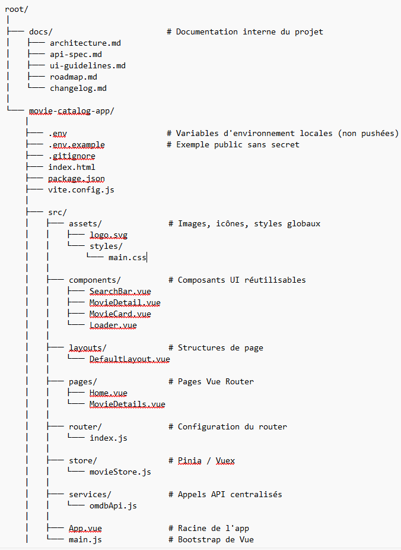

# Projet Front
## Auteurs
Ahmet Kharabulut, Jaruphong Plancherel et David Galindo

## But
Créer une application frontend en Vue.js qui consomme les données d'une API externe

## Installation

## Structure du projet

## API
API utilisée : OMDb API
Documentation: https://omdbpy.readthedocs.io/_/downloads/en/latest/pdf/

Lien pour les requêtes de données:
http://www.omdbapi.com/?apikey=[yourkey]&

Lien pour les requêtes d'images:
http://img.omdbapi.com/?apikey=[yourkey]&

Exemple d'utilisation :
Javascript
const response = await fetch(`${import.meta.env.VITE_TMDB_API_URL}/movie/popular?api_key=${import.meta.env.VITE_TMDB_API_KEY}&language=fr-FR`);

Vue
