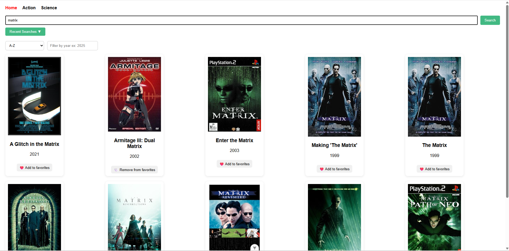

# Catalogue de Films

## Auteurs
Ahmet Kharabulut, Jaruphong Plancherel et David Galindo

## Synopsis
Ce projet est une application web développée avec Vue.js qui permet aux utilisateurs de rechercher des films et de consulter leurs détails. L'application utilise l'API de The Movie Database (TMDB) pour récupérer les informations sur les films.

## Aperçu



## Fonctionnalités

*   Recherche de films par titre.
*   Affichage d'une liste de films correspondant à la recherche.
*   Consultation des détails d'un film (synopsis, date de sortie, note, etc.).
*   Design responsive pour une utilisation sur mobile et bureau.
*   Historique de recherche et favoris.

## Technologies utilisées

*   **Frontend**: [Vue.js 3](https://vuejs.org/) (Composition API)
*   **Gestion d'état**: [Pinia](https://pinia.vuejs.org/)
*   **Routage**: [Vue Router](https://router.vuejs.org/)
*   **Client HTTP**: [Axios](https://axios-http.com/)
*   **Build Tool**: [Vite](https://vitejs.dev/)

## Prérequis

*   [Node.js](https://nodejs.org/) (version `^20.19.0 || >=22.12.0` comme spécifié dans `package.json`)
*   Un gestionnaire de paquets comme `npm` ou `yarn`.

## Installation et Configuration

1.  **Clonez le dépôt :**
    ```bash
    git clone https://github.com/akrblt/ProjFrontendVue.git
    cd movie-catalog-app
    ```

2.  **Installez les dépendances :**
    ```bash
    npm install
    ```

3.  **Configurez les variables d'environnement :**
    Créez un fichier `.env` à la racine du projet en copiant le modèle `.env.exemple` :
    ```bash
    cp .env.exemple .env
    ```
    Ouvrez le fichier `.env` et remplacez `YOUR_TMDB_API_KEY_HERE` par votre propre clé d'API TMDB.
    ```env
    # Clé API TMDB (à remplacer par une clé valide)
    VITE_TMDB_API_KEY=VOTRE_CLÉ_PERSONNELLE_ICI

    # URL de base de l'API
    VITE_TMDB_API_URL=https://api.themoviedb.org/3

    # URL de base pour les posters
    VITE_TMDB_POSTER_URL=https://image.tmdb.org/t/p/w500
    ```

## Utilisation

### Lancer le serveur de développement

Pour démarrer l'application en mode développement avec rechargement à chaud :
```bash
npm run dev
```
L'application sera accessible à l'adresse `http://localhost:5173` (ou un autre port si celui-ci est déjà utilisé).

### Créer un build pour la production

Pour créer une version optimisée de l'application pour la production :
```bash
npm run build
```
Les fichiers statiques seront générés dans le dossier `dist/`.

### Prévisualiser le build de production

Pour lancer un serveur local qui sert les fichiers du dossier `dist/` :
```bash
npm run preview
```
